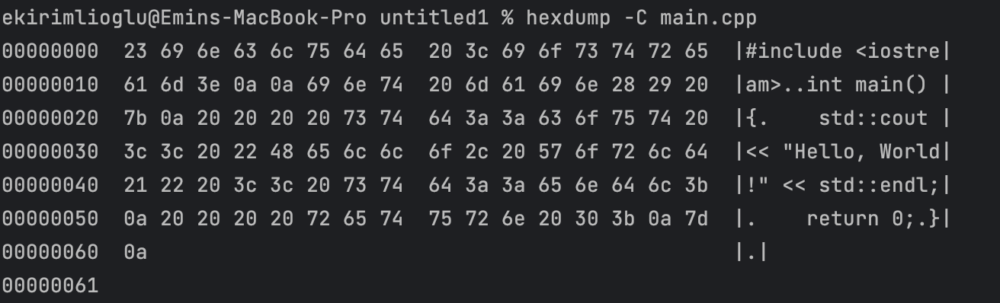
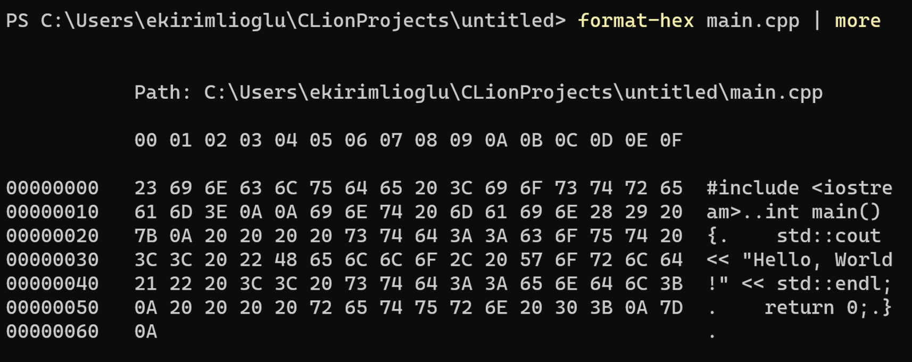

[](https://classroom.github.com/a/rxjmQ5yA)
# WI24-Assignment5
Let's build an archival system - Part 1
### Due Mar 4, 2023 at 11:30pm  (PST)

## Introduction

In this assignment, you're going to build a non-compressing **Archival** storage system.  An archive file is a single 
file that contains other files, much like a folder on your hard drive contains other files.  If you've used .archive or 
.zip files before, you get the idea.  It's important to note that when your tool is asked to store a document, it must 
be stored with 100% fidelity. You must not change the documents you store in any way. When the user extracts a stored 
document, it must be restored as an exact copy of the original.

### Overview
Your main `Archive` class will offer 5 key methods, that represent the major actions your `Archive` system supports:
1. Adding a file to the archive
2. Extracting a copy of a file from the archive
3. Removing a file from the archive (permanently)
4. Listing the names of all files in the archive
5. Performing a diagnostic "dump" of all the blocks in the file

In addition, your `Archival` tool will allow interested objects to register themselves as _observers_. _Observers_ will 
be notified of any primary action (add, extract, list, remove) performed by the `Archive` system by way of a callback.

Our testing framework will randomly call your `Archive` tool to perform a number of actions. Your `Archive` tool will 
perform the action, and notify any observers that the action occurred.  The testing framework will capture the output 
of your actions for verification.

## Specifics

### Creating an Archive Storage File
Before a user can work with an __archive__ file, it must be created. This action creates a new (empty) archive file in 
a standard location, ready to be used by the `Archive` tool.  We expect archive files to use the ".arc" file extension. 
So an archive file called "test" will actually have the name "test.arc".  

To create a new archive storage file, the user will call the static method, `Archive::create`, along with the desired 
filename. If this file already exists, it will be automatically truncated (emptied of all content and length set to 
zero); otherwise the new (empty) file is created.  For example, if a user tries to create an archive file called 
"test.arc", your code will try to create a file with that name.  Note that the static `Archive::create` method is a 
"factory" method, that returns a new `Archive` object for the user to work with. This `Archive` object will already 
have access with the opened associated binary file stream. If the file cannot be created, the `Archive::create` method 
will return a `nullptr`. 

### Opening a Pre-existing Archive Storage File 
Presuming that an existing __archive__ file already exists on disk, the user may choose to open that file for use. 
To open an __archive__ file, a user will call the static method, `Archive::open`, and pass the name of the file to be 
opened. Presuming that it's a legitimate __archive__ file, a new `Archive` object is returned, with the associated file 
opened and ready for use.  If the file doesn't exist (or isn't a real archive file) -- the `Archive::open` method will 
return a `nullptr`. 

### Archive Tool Commands 

#### __Add__ file to Archive
Assuming an open archive file (new or pre-existing), the user can add a new document to the archive by calling the 
`Archive::add` method. The signature for this method is given below:

```
bool add(std::string &aFullPath);
```

The `aFullPath` will contain the complete path (path+name) of a file to be added to the stream.  For example: 
"/tmp/small.txt".   The `Archive::add` method will copy the contents of the given file into a series of 1..n 
blocks within the archive itself. The document will be associated in the archive with the filename portion of 
the given full-path, so that it may be retrieved (extracted) or removed in the future. If everything goes works, 
this function call will return `True`.  For example, if `aFullPath` is "/tmp/small.txt", the name you store for 
the document is "small.txt" (exclude the path portion). 

Note, before you add a document to an open archive, you must make sure a document with that name doesn't already exist 
in the archive. Otherwise, you'll get a filename collision, and it would be unclear which doucment you're referring to 
with a given filename. In the user tries to add a document to an archive that already contains a file with that name, 
you should refuse, and return `False`. 

#### __Extract__ file from Archive
Assuming an open archive file (new or pre-existing), the user can extract a named resource inside the archive file. 
When the user calls this message and passes a document name, your code will search the archive for that file. If the 
file exists in the archive, your code will write the contents of the file from your storage blocks to a file at the 
given `fullPath`, and return `True`. If the named resource does not exist, `Archive::extract()` will stop and return 
`False`. 

> NOTE: The extracted file you send to the caller will be compared to the original version. These must match exactly!  
> Make sure you're careful about how you save information in your archive file, and how you extract that file - to avoid 
> unexpected changes. 

```
bool extract(std::string &aName, const std::string &aFullOutputPath);
```

#### __Remove__ file from Archive
Assuming an open archive file (new or pre-existing), the user can __remove__ a named resource inside the archive file. 
When the user calls this message and passes a document name, your code will search the archive for that file. If the 
file exists in the archive, your code will remove the named from the archive. Generally, this means that any internal 
block occupied by the document will be marked as "available" for reuse in a subsequent write operation in the archive. 
If this succeeds, return `True`. If the document name is not found in the archive, simply return `False` to the caller.

```
bool remove(std::string &aName);
```

#### __List__ files in Archive
Assuming an open archive file (new or pre-existing), the user can __list__ all the names of the documents stored inside 
the archive file. When the user calls this message, your code find all the documents stored internally, and print their 
name to the given `std::ostream` object. Return the number of files found in the archive. Sample  output format documents 
in the archive is given below:

```
###  name         size       date added
------------------------------------------------
1.   document1    203,400    2021-01-15 10:15:00
2.   document2    2,150      2021-01-16 16:22:30
```

Here is the __list__ method call:
```
size_t list(std::ostream);
```

#### __Dump__ archive blocks (debug mode)
Assuming an open archive file (new or pre-existing), the user can __dump__ information about the sequence of blocks 
stored inside the archive file. When the user calls this message, your code iterate the blocks (sequentially from first to last), 
and prints meta information about the block to the given `std::ostream` object. When the function is finished, return the 
number of blocks found in the archive. Sample output of the dump is given below:

```
###  status   name    
-----------------------
1.   empty    
2.   used     test.txt
3.   used     test.txt
4.   empty
```

Here is the __dump__ method call:
```
size_t debugDump(std::ostream anOutputStream);
```

Viewing hex dump of the files might be useful for debugging. You can use the following command to view the hex dump of
a file in Linux/Mac:

``` bash
$ hexdump -C <filename>
```



For windows, you can use the following command from powershell:

``` bash
$ format-hex <filename> | more
```



#### __Compact__ archive file 
This method will result in the archive file removing empty blocks. You may need to reorder blocks to satisfy this request. 
Once complete, the archive file will contain 0 empty blocks, and every block will contain data from an archived document. 
This method returns the total number of blocks in the given archive file.


### Enhancements for Archival System Functionality
In our ongoing effort to refine and enhance the capabilities of the archival system, we have integrated advanced mechanisms that empower the system to handle a broad spectrum of data processing tasks with efficiency and robustness. These enhancements are designed to be integral to the system's architecture, ensuring the high fidelity and integrity of stored documents.

#### Data Processing Interface
The IDataProcessor interface represents a fundamental architectural enhancement of the archival system. It provides a blueprint for data processing capabilities, enabling the system to execute sophisticated operations on data both before archival and upon retrieval. Implementations of this interface may include a variety of data transformations, ensuring adaptability and extensibility to meet future requirements.

- Process: A method designed for processing data prior to archival. This includes operations such as validation, encoding, or preparation for compression, facilitating a versatile preparation phase.
- ReverseProcess: A method aimed at reverting processed data back to its original state during extraction. This crucial feature ensures that the integrity of the data is preserved, allowing documents to be restored to their exact pre-archival state.

##### Note:
You don't have to implement the `IDataProcessor` interface in this assignment. It will be used in the next assignment.
You should think about how your `Archive` class will be designed to support this interface in the future.

#### Status Management with ArchiveStatus
The ArchiveStatus template class is instrumental in managing the operational status of actions performed within the archival system. It offers a unified approach to handling both successful outcomes and errors, providing clear and concise feedback mechanisms for the system's operations.

- Success Case: For operations like adding, extracting, or processing documents that are completed successfully, ArchiveStatus encapsulates the result. This encapsulation allows the system to confidently proceed with subsequent tasks.

- Error Case: In instances where operations face issues, ArchiveStatus identifies and captures the specific error encountered. This enables appropriate responses, such as error logging, user notification, or corrective actions, thus ensuring the system’s stability and reliability.  

#### Robust Error Handling
To enhance the system's robustness, an enum class of potential errors (ArchiveErrors) has been defined. This enum class addresses a broad range of potential system issues, 
from file access errors to data integrity concerns. Through explicit error handling, the system's resilience and reliability are significantly improved, 
ensuring that users are well-informed about the state of the system and any encountered issues.

### A Note About Storage Files 
As we discussed in lecture, your storage system will read/write archive files as sequence of fixed size blocks. Archive 
files will be opened in binary mode using C++ filestreams.  

Each block in your storage system will be exactly 1024 (1K) in size. As you write your code, we need to use as little 
space as possible in each block for overhead (meta information), so you can maximize the payload space for user document 
content. Specifically, you may not use more than 100 bytes of overhead per storage block, and at least 924 bytes for payload.  

```
[BLOCK
  [ meta area - max-size 100 bytes]
  [ data payload -- min-size 924 bytes..............................................]
]  
```

Think of each block in the archive storage file as either currently "in use", or marked as available for use (empty). 
How you manage this state in each block is up to you. The "used/free" property should be stored in the meta information 
area of each block. Also, you may need to store additional information in the meta area to support your implementation.
Think about what needs to be stored in the meta area so that the archive file can be read and written correctly. You might
need to store information about where the next block is located, how many blocks current file occupies, etc.


#### Example use case
Imagine that your user creates an archive file, and "adds" two text files that occupy 4 blocks (2 blocks each). Now 
imagine your user "removes" the first document. Your archive file would then have 2 unused blocks in middle somewhere 
that were no longer occupied (marked as empty). If the user then added a new file, it would be expected that you will 
first fill "empty/unused" blocks in your archive before appending additional blocks to the end of the archive.

```
A. USER ADDS 2 Docs   B. User removes doc #1     C. User adds new doc
[1 - doc1]            [1 - empty]                [1 - doc3]
[2 - doc1]            [2 - empty]                [2 - doc3]
[3 - doc2]            [3 - doc2]                 [3 - doc2]
[4 - doc2]            [4 - doc2]                 [4 - doc2]
                                                 [5 - doc3]
```

### Observation API
The `Observation` API offers a simple way for observer (objects) to be notified when your `Archive` class performs an  
action (add, remove, extract, list). Whenever any of the main methods of the `Archive` class are called, you will notify 
any registered observer of the action. 

If the user calls `add`, `extract`, or `remove`, you will notify each observer, and indicate the action-type that 
occurred ('added','extracted','removed','listed','dumped), the name of the document the action referred to, and a 
boolean value indicating whether the operation succeeded (T/F). Below is the functor call you will make to each observer 
in this case:

```
void operator()(ActionType anAction, const std::string &aName, bool status);
```

If the user called the "list", "compact", or "dump" commands on your archive, there is no specific document. In that case, 
just pass an empty string as the value for the `aName` argument to the observers, along with the action-type, and the 
result status.

#### Registering an Observer
A user may register one or more "observers" of your `Archive` class by calling the `Archive::addObserver()` method. 
This method will accept a single argument (a reference to an observer). Your `Archive` class needs to manage this list 
of registered observes, and notify each of them when the `Archive` class methods are called('add','extract','list','
remove','dump').

```
  bool addObserver(ArchiveObserver &anObserver);
```

This method should return true if the observer was successfully added to the list of observers. The observers should be 
stored in a data structure of your choice, such that you can iterate over them when you need to notify them of an
action.

## Testing
As in Assignment1, the testing of your code happens in a stand-alone file called `Testing.hpp`. This is called from 
`main.cpp`.  The `main()` function acts like a router, that accepts a command test on the command line, and calls the 
associated test in the `Testing.hpp` file. Each test returns true or false, which gets reported (on the command line) 
back to the testing system. There are seven tests (shown below). 

> Testing uses std::filesystem, which is only available in C++17 and above. If you are using an older version of C++,
> make sure to change your project settings to use C++17 or above. 

### Grading Rubric 
Your solution will be graded using the following rubric:

1. Create archive test -- 10%
2. Open archive test -- 10%
3. Add documents test -- 15%
4. Extract documents test -- 15%
5. Remove documents test -- 15%
6. List documents test -- 10%
7. Dump blocks test -- 10%
8. Stress Test -- 10%
9. Warnings and Memory Issues 5%


## Submitting your work 
Due Mar 4, 2023 at 11:30pm  (PST)
Make sure to turn in your code, and update the associated `student.json` file. 


